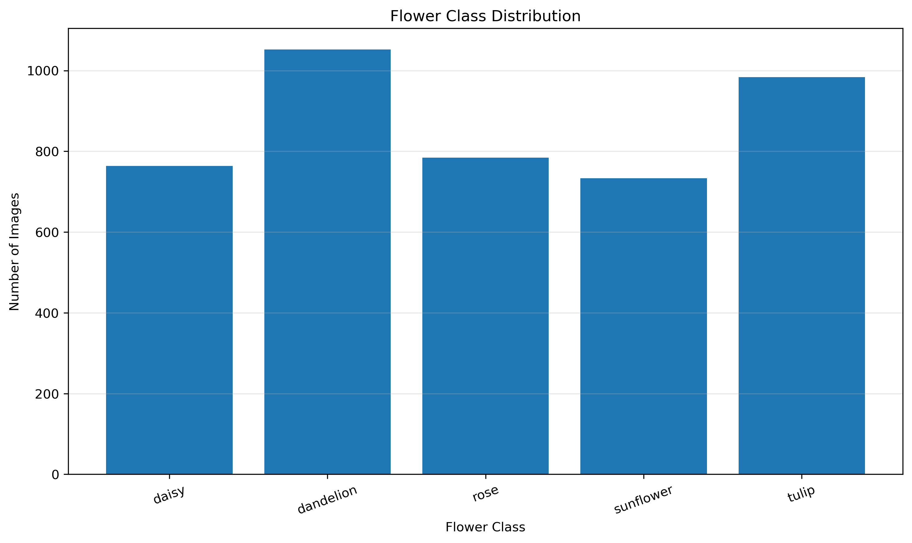
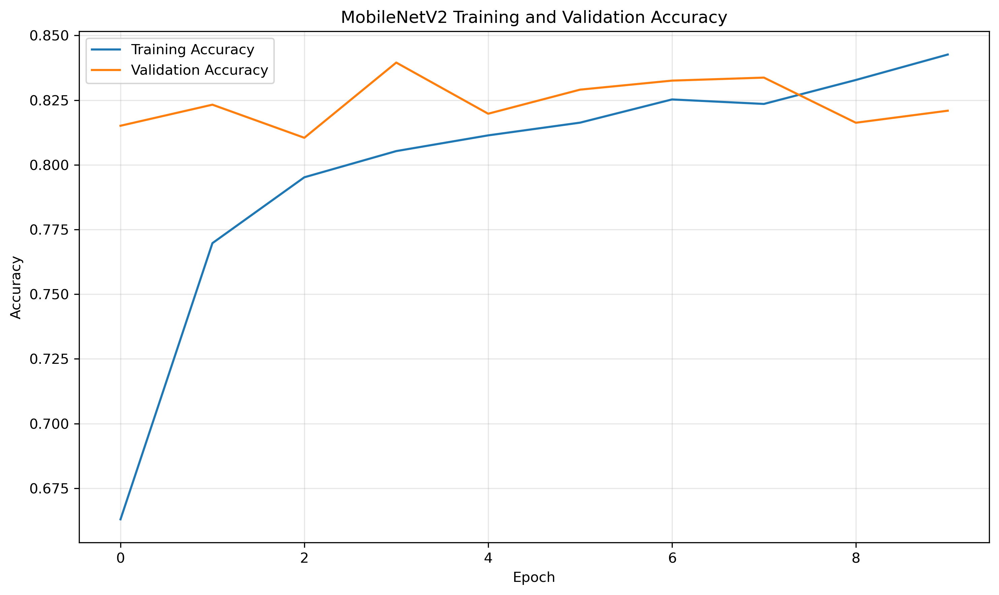
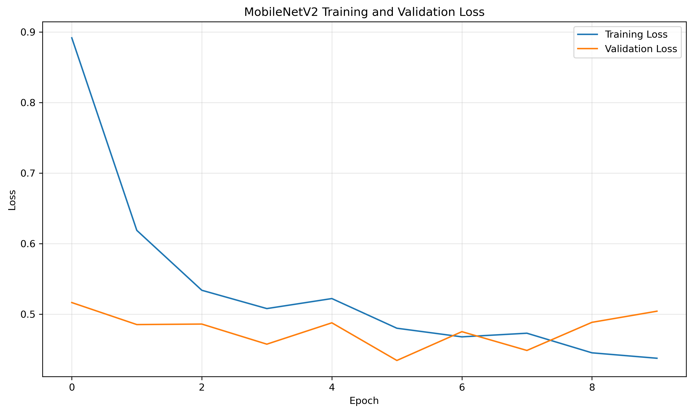
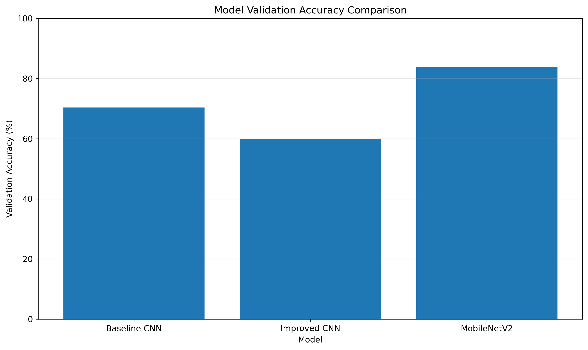
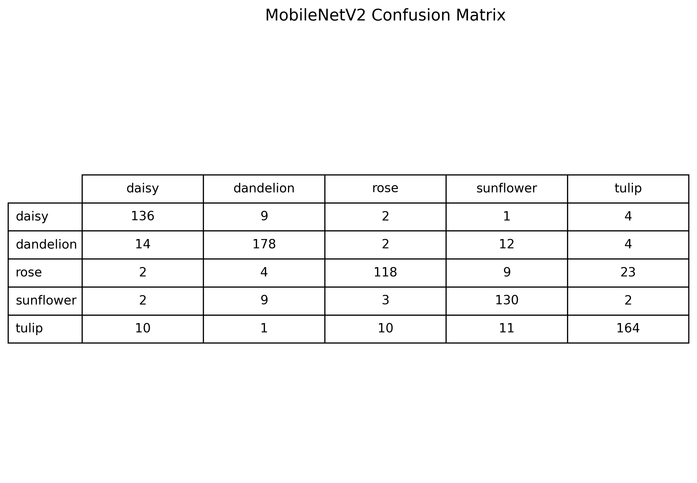
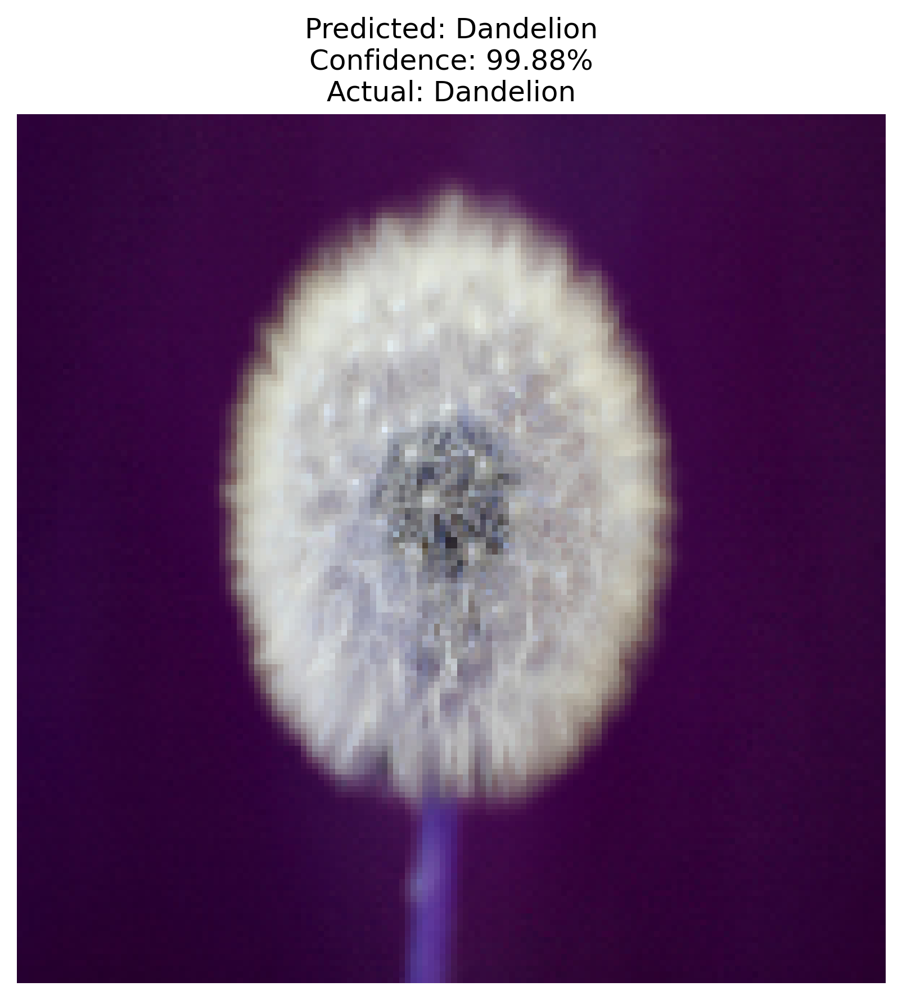

# 🌸 Flower Classification using Deep Learning

## Overview

This project focuses on classifying flower images into five different categories using deep learning techniques.

The dataset contains images of:

- Daisy
- Dandelion
- Rose
- Sunflower
- Tulip

The project compares a baseline Convolutional Neural Network (CNN), an improved CNN architecture, and a transfer learning approach using MobileNetV2. The objective is to identify the model that provides the best classification performance.

---

## Project Objectives

- Classify flower images into five categories.
- Perform image preprocessing and data augmentation.
- Build and evaluate CNN-based deep learning models.
- Compare different model architectures.
- Use transfer learning with MobileNetV2.
- Evaluate the final model using accuracy, classification report, and confusion matrix.
- Save the trained model and generated results for reproducibility.

---

## Dataset

The dataset contains **4,317 flower images** belonging to five classes.

| Flower Class | Number of Images |
|--------------|-----------------:|
| Daisy        | 764              |
| Dandelion    | 1,052            |
| Rose         | 784              |
| Sunflower    | 733              |
| Tulip        | 984              |
| **Total**    | **4,317**        |

### Classes

- Daisy
- Dandelion
- Rose
- Sunflower
- Tulip

---

## Technologies Used

- Python
- TensorFlow
- Keras
- NumPy
- Pandas
- Matplotlib
- Scikit-learn
- Seaborn
- Pillow
- Jupyter Notebook
- Git
- GitHub

---

## Project Structure

```text
Flower-Classification-DeepLearning/
│
├── data/
│   └── flowers/
│       ├── daisy/
│       ├── dandelion/
│       ├── rose/
│       ├── sunflower/
│       └── tulip/
│
├── images/
├── models/
├── notebooks/
├── results/
├── src/
│
├── README.md
├── requirements.txt
└── .gitignore ```

### Methodology

The project follows the following deep learning workflow:

### 1. Dataset Validation

The flower dataset is organized into five classes:

- Daisy
- Dandelion
- Rose
- Sunflower
- Tulip

The dataset contains a total of **4,317 images**. The number of images in each class is checked before model training.

### 2. Image Preprocessing

All input images are resized to **150 × 150 pixels** to provide a consistent input size for the deep learning models.

Pixel values are normalized to the range **0–1** by dividing the pixel values by 255.

### 3. Data Augmentation

Data augmentation is applied to the training images to improve model generalization.

The following augmentation techniques are used:

- Rotation
- Width shifting
- Height shifting
- Zooming
- Horizontal flipping

### 4. Train-Validation Split

The dataset is divided into:

- **80% training data**
- **20% validation data**

The training data is used to learn the model parameters, while the validation data is used to monitor model performance during training.

### 5. Baseline CNN Model

A basic Convolutional Neural Network (CNN) is developed as the baseline model.

The architecture contains:

- Convolutional layers
- Max-pooling layers
- Flatten layer
- Dense layer
- Dropout layer
- Softmax output layer

The baseline CNN achieved a validation accuracy of approximately **70.35%**.

### 6. Improved CNN Model

A deeper CNN architecture is then evaluated by adding additional convolutional layers and batch normalization.

However, the improved CNN achieved approximately **60% validation accuracy**, which was lower than the baseline CNN.

Therefore, the improved CNN was not selected as the final model.

### 7. MobileNetV2 Transfer Learning

To improve classification performance, **MobileNetV2** pretrained on ImageNet is used.

The pretrained convolutional layers are initially frozen and used as a feature extractor.

A custom classification head is added consisting of:

- Global Average Pooling
- Dense layer with 128 neurons
- Dropout layer
- Softmax output layer with 5 classes

MobileNetV2 achieved the best validation performance among the evaluated models.

### 8. Model Training

The MobileNetV2 model is trained using:

- Adam optimizer
- Categorical cross-entropy loss
- Accuracy as the evaluation metric
- Early stopping to reduce unnecessary training and help prevent overfitting

### 9. Model Evaluation

The trained model is evaluated using:

- Validation accuracy
- Validation loss
- Precision
- Recall
- F1-score
- Confusion matrix

The classification report is generated for all five flower categories.

### 10. Model Comparison

The performance of the three models is compared:

| Model            | Validation Accuracy |
|------------------|--------------------:|
| Baseline CNN     | 70.35%              |
| Improved CNN     | ~60%                |   
| **MobileNetV2**  | **83.95%**          |

MobileNetV2 provides the best validation accuracy and is selected as the final model.

### 11. Individual Image Prediction

The trained MobileNetV2 model is tested on an individual flower image.

For the sample prediction, the model correctly classified a **Dandelion** image as Dandelion with **99.99% confidence**.

### 12. Model and Results Storage

The trained MobileNetV2 model is saved in the `models/` directory.

Evaluation results are stored in the `results/` directory.

Generated graphs and visualizations are stored in the `images/` directory.


### Best Model

**MobileNetV2** achieved the highest validation accuracy of **83.95%** among the evaluated models.

The baseline CNN achieved 70.35%, while the improved CNN achieved approximately 60%. Therefore, MobileNetV2 was selected as the final model.

---

## MobileNetV2 Results

The best results recorded during MobileNetV2 training were:

| Metric                   | Value      |
|--------------------------|-----------:|
| Best Validation Accuracy | **83.95%** |
| Best Validation Loss     | **0.4342** |
| Final Training Accuracy  | **84.26%** |

---

## Classification Report

The MobileNetV2 model achieved approximately **82% accuracy** on the validation predictions.

| Class      | Precision | Recall   | F1-Score |
|------------|----------:|----------|---------:|
| Daisy      | 0.83      | 0.89     | 0.86     |
| Dandelion  | 0.89      | 0.86     | 0.87     |
| Rose       | 0.78      | 0.74     | 0.76     |
| Sunflower  | 0.78      | 0.82     | 0.80     |
| Tulip      | 0.81      | 0.80     | 0.80     |
| **Overall**| **0.82**  | **0.82** | **0.82** |

Rose was the most challenging class based on its lower recall and F1-score.

---

## Results Visualization

### Class Distribution



### MobileNetV2 Training Accuracy



### MobileNetV2 Training Loss



### Model Comparison



### Confusion Matrix



The diagonal values in the confusion matrix represent correctly classified images, while off-diagonal values represent misclassified images.

---

## Sample Prediction

The trained MobileNetV2 model was tested on an individual flower image.

- **Actual Class:** Dandelion
- **Predicted Class:** Dandelion
- **Confidence:** 99.99%



The model correctly classified the sample Dandelion image with very high confidence.

## Limitations

- The dataset contains only five flower categories.
- The number of images differs between classes.
- Visually similar flowers can be difficult to distinguish.
- Model performance may vary on images from external datasets.
- The model has not been evaluated on a completely independent external dataset.
- The model is intended for educational and research purposes.

---

## Future Improvements

- Add more flower categories and images.
- Increase the size and diversity of the dataset.
- Fine-tune the pretrained MobileNetV2 layers.
- Experiment with other transfer learning architectures such as EfficientNet and ResNet.
- Perform systematic hyperparameter optimization.
- Develop a web application for real-time flower classification.
- Add explainable AI techniques for model interpretation.
- Evaluate the final model on an independent external dataset.

---

## Installation

Clone the repository and install the required dependencies:

```bash
git clone <your-github-repository-url>
cd Flower-Classification-DeepLearning
pip install -r requirements.txt

## Usage

Follow the steps below to run the Flower Classification project.

1. Open the `Flower-Classification-DeepLearning` project folder in Visual Studio Code or another Python development environment.

2. Install all required dependencies using the following command:

    pip install -r requirements.txt

3. Open the main Jupyter Notebook:

    notebooks/01_flower_classification.ipynb

4. Select the Python environment in which all required dependencies are installed.

5. Run the notebook cells in order from top to bottom.

6. The notebook performs the complete flower classification workflow, including:

   - Dataset validation
   - Flower class verification
   - Image visualization
   - Class distribution analysis
   - Image preprocessing
   - Data augmentation
   - Train-validation data preparation
   - Baseline CNN model training
   - Improved CNN model training
   - MobileNetV2 transfer learning
   - Model evaluation
   - Confusion matrix generation
   - Classification report generation
   - Individual flower image prediction

7. After running the notebook, the generated files are stored in the following directories:

   - `models/` — contains the trained MobileNetV2 model.
   - `results/` — contains model performance and comparison results.
   - `images/` — contains generated graphs, confusion matrix, class distribution, and sample prediction visualizations.

8. The final trained MobileNetV2 model is saved as:

    models/flower_mobilenetv2.keras

9. The saved model can be loaded using TensorFlow/Keras and used to predict the class of new flower images.

---

## Conclusion

This project demonstrates the application of deep learning techniques for automated flower image classification.

Three approaches were evaluated: a baseline CNN, an improved CNN, and MobileNetV2 transfer learning.

Among the evaluated models, MobileNetV2 achieved the best validation accuracy of 83.95%.

The results demonstrate that transfer learning can provide better performance than training a CNN from scratch for this flower classification task.

The trained model, notebook, results, and visualizations are included in the repository for further experimentation and development.

---

